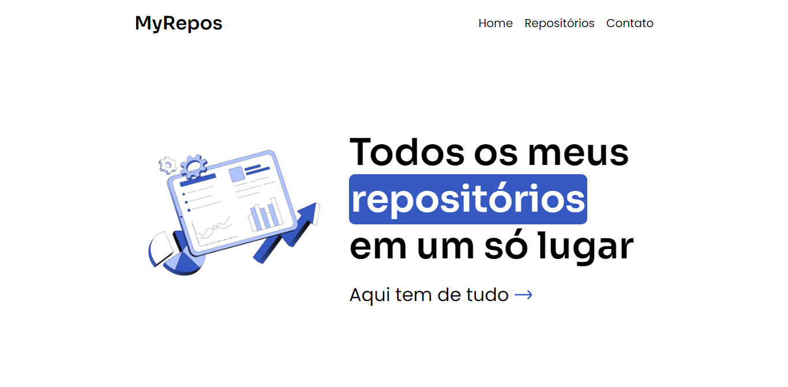

<h1 align="center"> myRepos </h1>

Fui fazer um teste e acabei criando um site inteiro 😐👍

  <a href="#-tecnologias">Tecnologias</a>&nbsp;&nbsp;&nbsp;|&nbsp;&nbsp;&nbsp;
  <a href="#-projeto">Projeto</a>&nbsp;&nbsp;&nbsp;|&nbsp;&nbsp;&nbsp;
  <a href="#-contato">Contato</a>

  

 

  

## 🚀 Tecnologias

Esse projeto foi desenvolvido com as seguintes tecnologias:

- HTML
- CSS
- JavaScript

## 💻 Projeto

A ideia de fazer esse site surgiu quando eu estava estudando o `fetch` do JavaScript. E, pensei que seria muito legal mostrar meus projetos através dessa ferramenta!

Veja o site clicando nesse [link](https://matheusfdosan.github.io/myRepos/).

## Contato

- Acesse também meus outros repositórios no [Github](https://github.com/matheusfdosan?tab=repositories).

- Também me siga no [Instagram](https://instagram.com/matheusfdosan).
